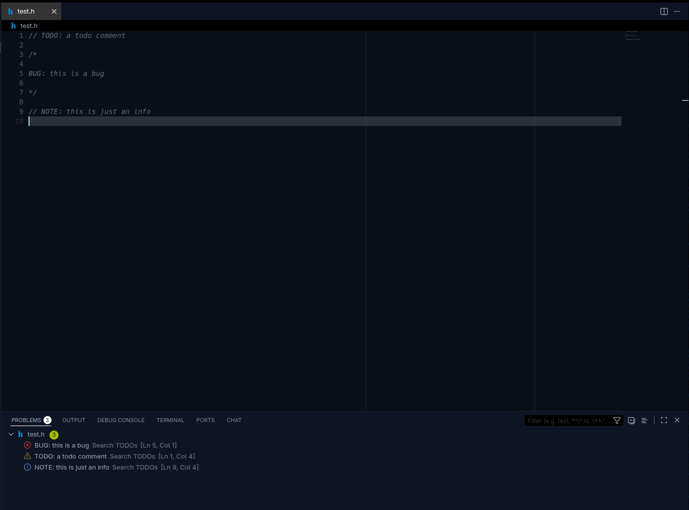

## Overview

This extension will scan your workspace and opened files for **FIXME**, **BUG**, **TODO**, **HACK**, **XXX**, **NOTE**, **REVIEW**
comments, and displays them in the `problems` panel.

## Features

- **Full workspace scan on startup** — automatically scans every file in the workspace, and reports all matches in the problems panel.
- **Re-scan on save** — when you save a file, it is immediately re-scanned and its diagnostics are updated.
- **Re-scan on open** — when you open a file in the editor, it is re-scanned so new changes are picked up right away.
- **Configurable keywords & severity** — define your own keywords and assign each one a diagnostic severity (`error`, `warning`, `info`, `hint`).
- **Case-sensitive by default** — only exact-case matches are detected (e.g. `TODO` but not `todo`). Can be toggled to case-insensitive via settings.
- **Include / exclude glob patterns** — control which files are scanned using glob patterns.

## Default Keywords & Severities

| Keyword | Severity |
|-|-|
| FIXME | Error |
| BUG | Error |
| TODO | Warning |
| HACK | Warning |
| XXX | Warning |
| NOTE | info |
| REVIEW | hint |

## Extension Settings

| Setting | Type | Default | Description |
|---------|------|---------|-------------|
| `searchTodos.keywords` | `array` | See above | Array of `{ "keyword": string, "severity": "error" \| "warning" \| "info" \| "hint" }` objects defining which keywords to scan for and their diagnostic severity. |
| `searchTodos.include` | `string[]` | `["**/*"]` | Glob patterns for files to include when scanning. |
| `searchTodos.exclude` | `string[]` | `["**/.git/**", "**/.vscode/**", "**/node_modules/**", "**/build/**", "**/dist/**", "**/out/**"]` | Glob patterns for files to exclude when scanning. |
| `searchTodos.caseSensitive` | `boolean` | `true` | Whether keyword matching is case-sensitive. When `true`, only exact-case matches are detected. |
