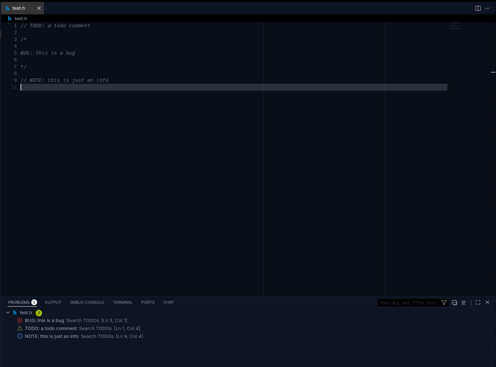

This extension will scan your workspace and opened files for
**FIXME**, **TODO**, **HACK**, **XXX**, **NOTE**
comments, and displays them in the **PROBLEMS** panel.

### Features

- You can define your own keywords.
- You can change the regex pattern used for matching the keywords.
- You can exclude directories from scanning.
- You can disable it per file type level.

### Default Keywords & Severities

| Keyword | Severity |
|-|-|
| FIXME | Error |
| TODO | Warning |
| HACK | Warning |
| XXX | Warning |
| NOTE | Info |

### Settings

| Name | Description |
| - | - |
| Case Sensitive | Whether keyword matching is case-sensitive. When true, only exact case matches (e.g. TODO, not todo) are detected. |
| Enable | Enable or disable scanning for TODO comments. When false, all diagnostics are cleared and no scanning occurs. Can also be overridden per language (e.g. \"[python]\": { \"displayTodos.enable\": false }). |
| Exclude | Glob patterns for files to exclude when scanning. If you only want the opened files to be scanned, exclude everything with `**/*`. |
| Include | Glob patterns for files to include when scanning. |
| Keywords | List of keywords to scan for and their diagnostic severities. |
| Pattern | Regex pattern used to match keywords. Use {keywords} as a placeholder for the joined keyword alternatives. Must contain two capture groups: group 1 for the matched keyword and group 2 for the trailing text. |
